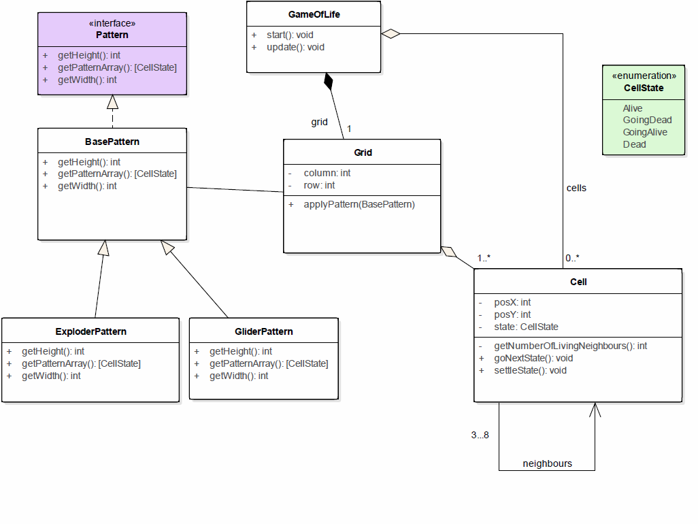

# Conway's Game of Life

## Rule of the game

The universe of the Game of Life is an infinite two-dimensional grid of square cells, each of which is in one of two possible states, alive or dead, or "populated" or "unpopulated".

Every cell interacts with its eight neighbors, which are the cells that are horizontally, vertically, or diagonally adjacent.  (The corner cells have three neighbors.)

At each step in time, the following transitions occur:

- Any live cell with fewer than two live neighbors dies, as if caused by under population.
- Any live cell with two or three live neighbors lives on to the next generation.
- Any live cell with more than three live neighbors dies, as if by overpopulation.
- Any dead cell with exactly three live neighbors becomes a live cell, as if by reproduction.

The initial pattern constitutes the seed of the system. The first generation is created by applying the above rules simultaneously to every cell in the seed.

## Class Diagram 

## State Diagram

